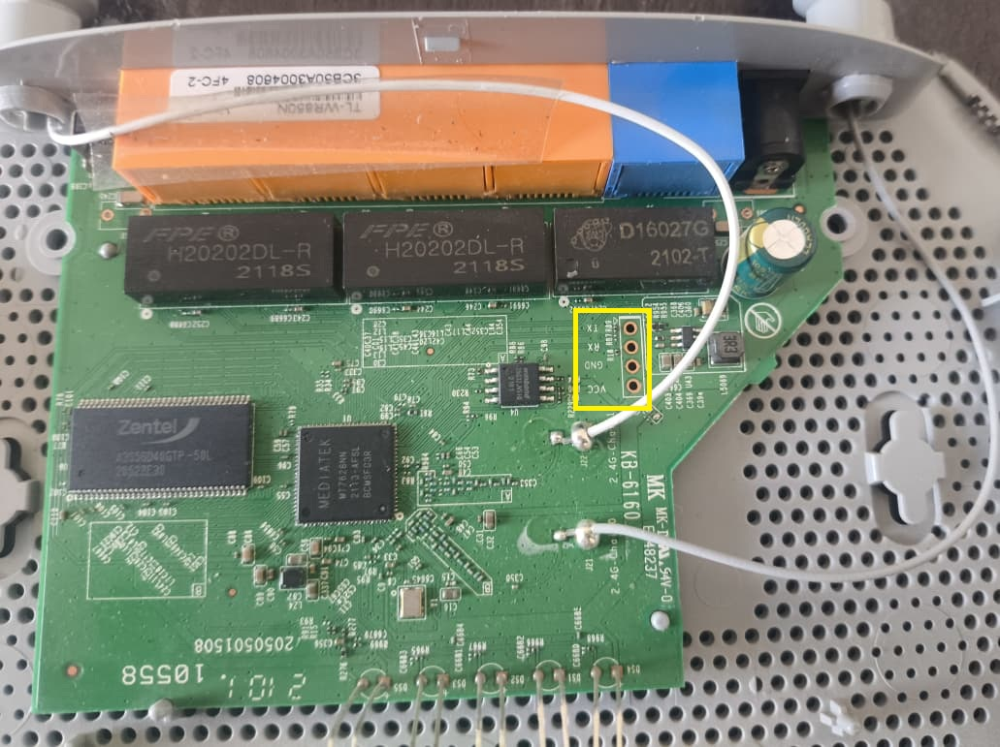
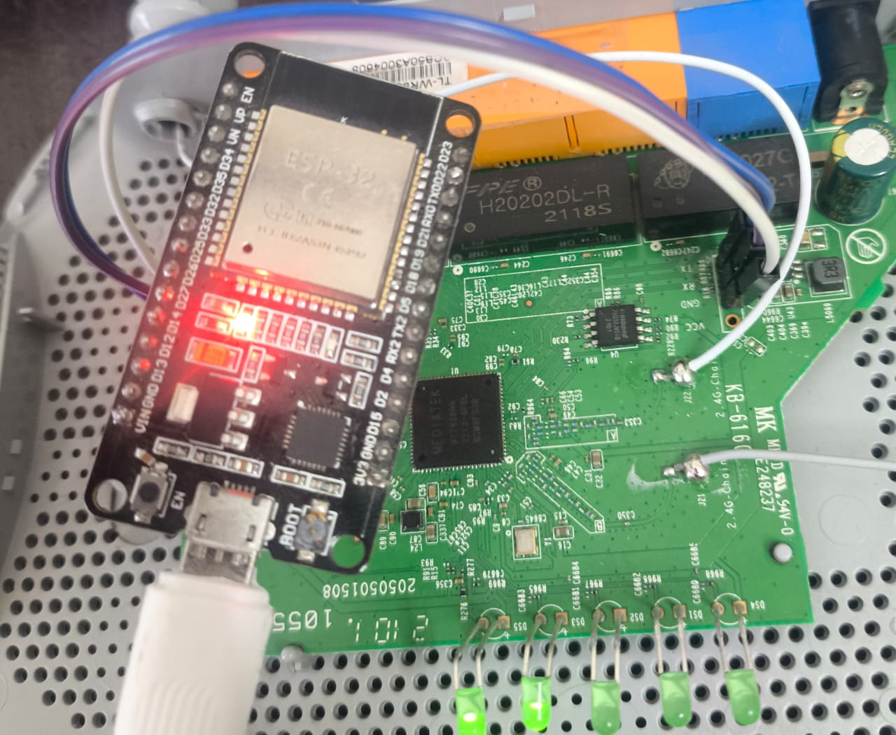
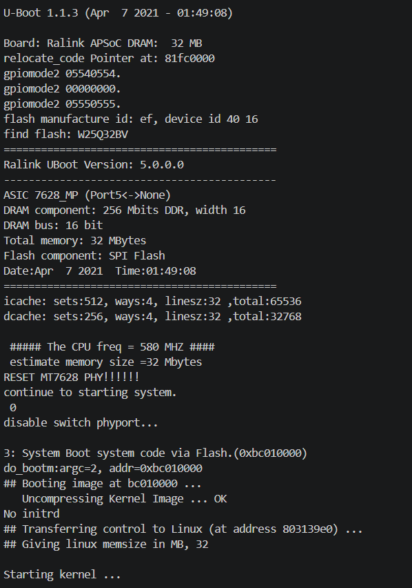
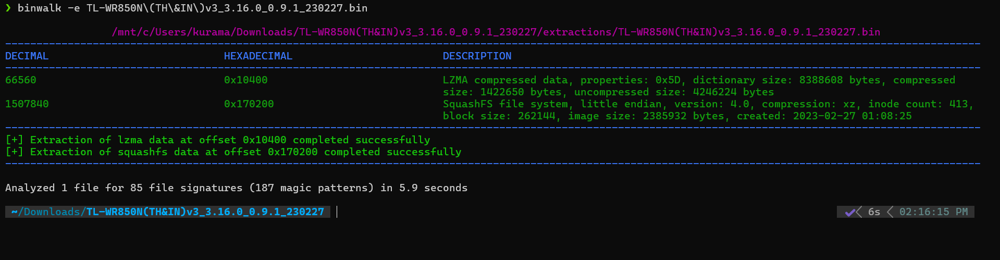
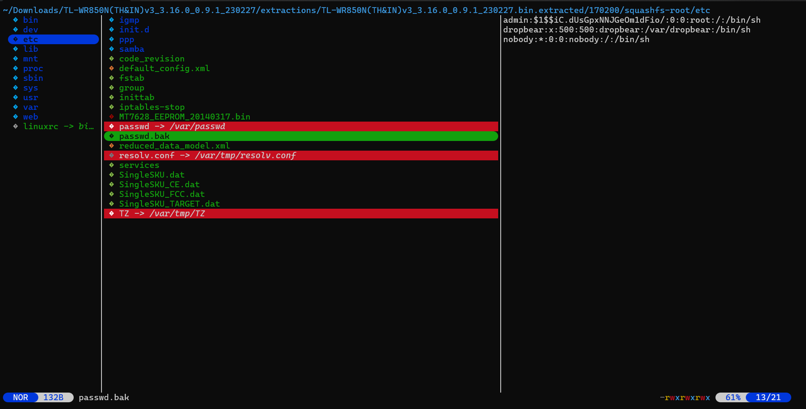
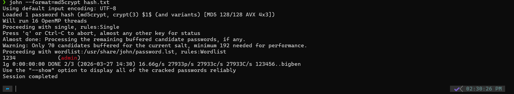
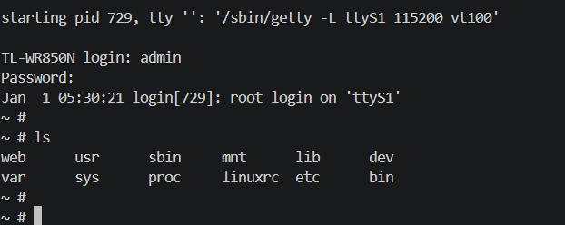

# 🛠️ Reverse Engineering the TP-Link TL-WR850N

### From UART Access → Firmware Exploitation → Root Shell


-blue)


---

## 📌 Project Overview

This project demonstrates a complete hardware-to-software exploitation workflow on a **TP-Link TL-WR850N (TH&IN)v3 router**, showing how physical access can lead to **full root shell compromise**.

It combines:

* Hardware debugging
* Firmware reverse engineering
* Toolchain patching
* Password cracking

---

## 🎯 Objectives

* Identify UART debug interface
* Automate baud rate detection using ESP32
* Extract vendor-modified SquashFS firmware
* Patch legacy tools for modern GCC
* Recover credentials from password hashes

---

# Phase 1: Hardware Recon & UART

I used an ESP32 to access the UART serial shell. You can also use a UART-to-serial (TTL) bridge.

##  UART Pins on PCB



We are lucky to have the pins labeled as shown above. Now we just need to solder header pins.

##  ESP32 Wiring



MODEL - ESP32 (WROOM32) DevKit V1

* TX  → Pin 16 (RX2)
* RX  → Pin 17 (TX2)
* GND → GND

---

## Baud Rate Detection

You can try the default baud rate **115200 bps** for most TP-Link routers.
Alternatively, you can find it using trial with standard baud rates.

Flash the ESP32 with the provided code, then:

1. Connect ESP32
2. Open serial monitor
3. Power on the router

You should see U-Boot logs similar to the image below.

##  Serial Output



If you see random ASCII characters, it means the baud rate is incorrect.

---

# Phase 2: Firmware Extraction

In some cases, you may directly get a root shell via UART.
However, most devices are password protected.

Common default credentials:

```
admin:admin  
root:admin  
```

If these do not work, we need to reverse engineer the firmware to extract password hashes and crack them using John the Ripper or Hashcat.

We will use **binwalk** to extract the firmware.

Run this command in your Linux shell:

```zsh
binwalk -e firmware.bin
```

Make sure `binwalk` and `squashfs` are installed before running this command.

This will create an `/extraction` folder containing the firmware.

---

## Binwalk Output



In the extracted files, navigate to `/etc`.
You will find files like `passwd.bak` or `shadow` containing usernames and hashed passwords, as shown below.

## Extraction Process



---


# 🔐 Phase 3: Cracking the Password Hash

From the image, the hash is:

```
$1$$iC.dUsGpxNNJGeOm1dFio/
```

This is an **MD5-crypt ($1$)** hash.

We will use **John the Ripper** to crack it.

Copy the hash into `hash.txt` and run:

```zsh
john --format=md5crypt hash.txt
```

This performs a dictionary-based brute-force attack using built-in wordlists.

## Cracking Result



As shown, we successfully recovered the password.

---

# Root Access

Using the recovered credentials, log in via UART:

## Root Shell



We now have access to the root shell.

---

With root access, we can:

* Analyze how the router works
* Modify system behavior
* Add services
* Install backdoors for pentesting purposes

---

⚠️ This was performed on my own device for educational purposes only.


# PlatformIO Project Setup

## Clone the Repository

```bash
git clone https://github.com/rudra-patell/tp-link_UART-reverse-shell.git
cd tp-link_UART-reverse-shell
```

---

##  Open Project in PlatformIO

### Option 1: VS Code (Recommended)

1. Install **VS Code**
2. Install **PlatformIO IDE extension**
3. Open VS Code
4. Click **File → Open Folder**
5. Select the project folder

PlatformIO will automatically detect the project using `platformio.ini`.

---

### Option 2: PlatformIO CLI

Make sure PlatformIO Core is installed:

```bash
pip install platformio
```

Then run:

```bash
pio project init
```

---

## 🔧Install Dependencies

PlatformIO will automatically install required frameworks and libraries when you build the project.

To manually trigger:

```bash
pio run
```

---

##  Upload to ESP32

Connect your ESP32 and run:

```bash
pio run --target upload
```

---

## 🔍 Open Serial Monitor

```bash
pio device monitor
```

---

## ⚠️ Notes

* Ensure correct COM port is selected in `platformio.ini`
* Default baud rate: `115200`
* If upload fails, check USB drivers and permissions

---

# 🧑‍💻 Author

**Rudra Patel**
