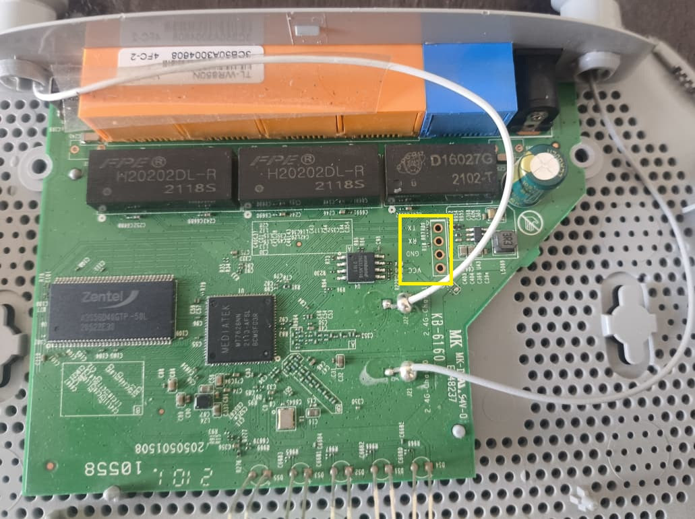
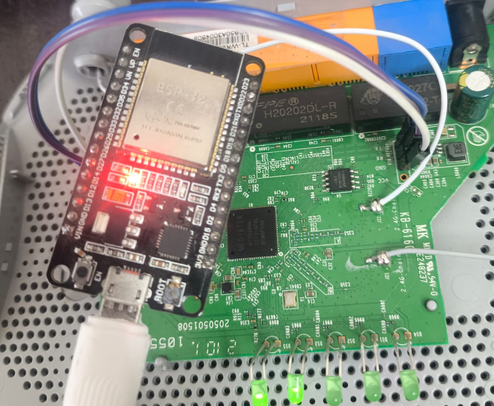
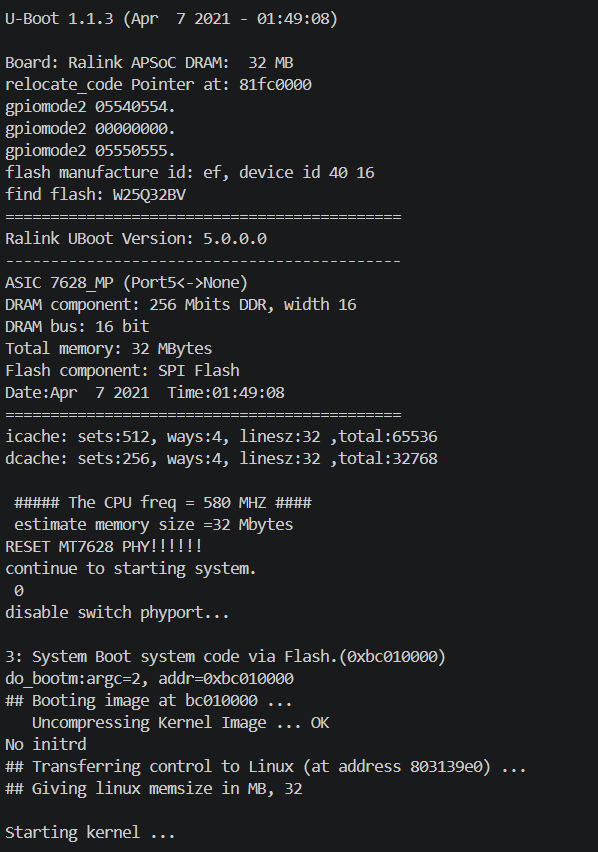
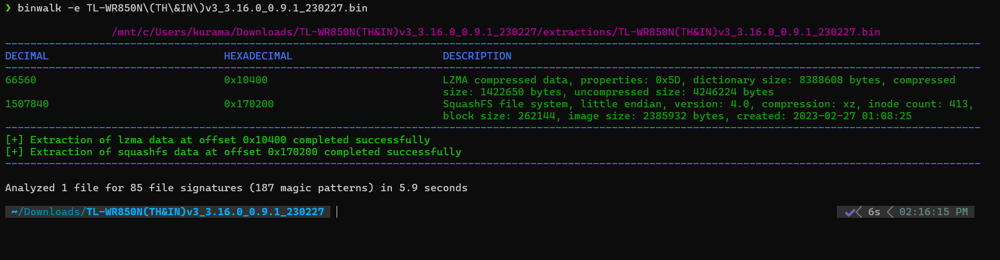
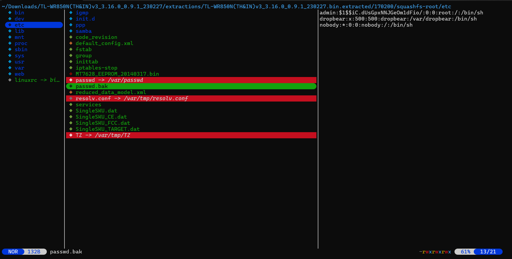
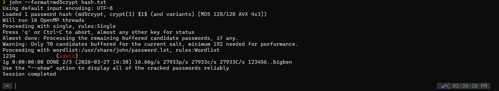
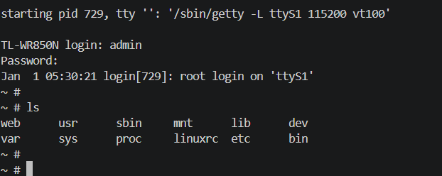

# TP-Link TL-WR850N — UART Debug Interface & Firmware Analysis

### From Physical Access → Firmware Extraction → Root Shell


-blue)


---

## Overview

A complete hardware-to-software security analysis of a TP-Link TL-WR850N (TH&IN) v3 router, demonstrating how an exposed UART debug interface can lead to full root shell access without any network-based exploitation.

Covers: hardware reconnaissance, baud rate detection, firmware extraction, filesystem analysis, and credential recovery.

> ⚠️ Performed on my own device for security research and educational purposes only.

---

## Methodology

```
Physical Access
    └─► Identify UART pins on PCB
          └─► Connect ESP32, detect baud rate
                └─► Access serial console (TTY)
                      ├─► Direct root shell (if unprotected)
                      └─► Password protected
                            └─► Download firmware binary
                                  └─► binwalk extraction → SquashFS
                                        └─► Extract password hash → John the Ripper
                                              └─► Authenticate → Root Shell
```

---

# Phase 1: Hardware Recon & UART

## UART Pins on PCB



The TL-WR850N has UART pins labeled directly on the PCB — TX, RX, VCC, GND. Soldered standard header pins for connection.

## ESP32 Wiring



MODEL - ESP32 (WROOM32) DevKit V1

* TX  → Pin 16 (RX2)
* RX  → Pin 17 (TX2)
* GND → GND

---

## Baud Rate Detection

Default baud rate for most TP-Link routers: **115200 bps**.

Flash the ESP32 with the provided baud rate scanner (`src/`), connect, power on the router, and observe U-Boot logs in the serial monitor. Garbled ASCII output means wrong baud rate.

## Serial Output



---

# Phase 2: Firmware Extraction

The device was password protected — default credentials (`admin:admin`, `root:admin`) did not work. Downloaded the firmware binary from TP-Link's official site and extracted using binwalk.

```bash
binwalk -e firmware.bin
```

Make sure `binwalk` and `squashfs` are installed before running this command. This will create an `/extraction` folder containing the filesystem.

## Binwalk Output



Navigate to `/etc` in the extracted filesystem. You will find `passwd.bak` or `shadow` containing usernames and hashed passwords.

## Extraction Process



---

# Phase 3: Credential Recovery

The extracted hash format is MD5-crypt (`$1$`):

```
$1$$iC.dUsGpxNNJGeOm1dFio/
```

Cracked using John the Ripper with its built-in wordlist:

```bash
john --format=md5crypt hash.txt
```

## Cracking Result



---

# Root Access

Authenticated via the UART serial console using the recovered credentials:

## Root Shell



Full root access achieved — no network exploitation, no CVE, no software vulnerability. Physical access to the device was sufficient.

---

# ESP32 Baud Rate Scanner — Setup

## Clone the Repository

```bash
git clone https://github.com/rudra-patell/tp-link_UART-root-shell.git
cd tp-link_UART-root-shell
```

## Open in PlatformIO

### Option 1: VS Code (Recommended)

1. Install **VS Code**
2. Install **PlatformIO IDE extension**
3. Click **File → Open Folder** → select the project folder

PlatformIO will automatically detect the project via `platformio.ini`.

### Option 2: CLI

```bash
pip install platformio
pio run --target upload
pio device monitor
```

**Notes:**
* Ensure correct COM port is set in `platformio.ini`
* Default monitor baud: `115200`
* If upload fails, check USB drivers and permissions

---

## Key Takeaways

* UART debug interfaces are frequently left exposed and labeled on consumer hardware
* Vendor-modified SquashFS filesystems often contain recoverable credentials in `/etc`
* MD5-crypt hashes (`$1$`) are weak by modern standards and trivially crackable
* Physical access to a device should be treated as equivalent to full system compromise — firmware encryption and secure boot are the mitigations

---

## Tools Used

| Tool | Purpose |
|---|---|
| ESP32-WROOM-32 | UART bridge / baud rate scanner |
| binwalk | Firmware extraction |
| John the Ripper | MD5-crypt hash cracking |
| PlatformIO | ESP32 firmware development |

---

## License

MIT
